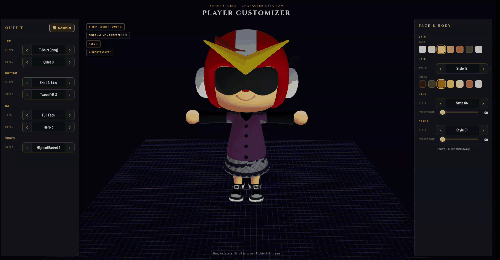

# ACNH Player Customizer

A 3D player character customizer built with Three.js using extracted Animal Crossing: New Horizons model data (DAE + PNG).

## Preview



## Features

- **Hair** — 48 hairstyles with color picker
- **Eyes** — 26 eye styles with 16 expression frames (blink animation)
- **Mouth** — 4 mouth styles with 9 expression frames
- **Face** — 3 cheek blush styles + skin tint color picker

## Setup

### 1. Place model files

Create a junction/symlink from `public/models` to your extracted ACNH model folder:

```bash
# Windows (run as admin)
mklink /J "public\models" "path\to\ACNH_2.0.0_Exported_Model_DAE+PNG\Model"

# macOS / Linux
ln -s /path/to/ACNH_2.0.0_Exported_Model_DAE+PNG/Model public/models
```

The folder structure should look like:

```
public/models/
  PlayerBody.Nin_NX_NVN/
    PlayerBody.dae
    mSkin_Alb.png
    ...
  PlayerHair00.Nin_NX_NVN/
    PlayerHair00.dae
    mHair_AlbGry.png
    ...
  PlayerEye00.Nin_NX_NVN/
    mEye_Alb.0.png
    ...
  PlayerMouth00.Nin_NX_NVN/
    mMouth_Alb.0.png
    ...
```

### 2. Install and run

From the project root:

```bash
pnpm install
npm run dev
```

Open `http://localhost:5173` in your browser.

## Player Character Model Structure

The player character is modular — it's assembled from separate body parts, not a single model like the NPC cats.

### Core Parts

| Part | Folder | Has .dae? | Textures |
|------|--------|-----------|----------|
| Body | `PlayerBody` | Yes (`PlayerBody.dae`) | Skin, cheek, nose, face paint PNGs |
| Hair | `PlayerHair00` – `PlayerHair47` | Yes (48 styles) | Hair color/normal/mix PNGs |
| Hair (hat mode) | `PlayerHairCap03`, `Cap05`, etc. | Yes (25 variants) | Compressed hair for under hats |
| Eyes | `PlayerEye00` – `PlayerEye25` | No .dae (texture-only) | 26 eye styles, 16 blink frames each |
| Mouth | `PlayerMouth00` – `PlayerMouth03` | No .dae (texture-only) | 4 mouth shapes, 9 frames each |

### Clothing (mesh + separate texture folders)

| Part | Mesh Folders | Texture Folders |
|------|-------------|-----------------|
| Tops | 79 silhouette meshes (`PlayerTopsTopTshirtsN`, etc.) | 2,426 `TopsTex*` folders (PNG only) |
| Bottoms | 7 silhouette meshes (`PlayerBottomsPantsNormal`, etc.) | 774 `BottomsTex*` folders (PNG only) |
| Hats | 954 `Cap*` folders | .dae + textures together |
| Shoes | 503 `Shoes*` folders | .dae + textures together |
| Bags | 204 `Bag*` folders | .dae + textures together |
| Accessories | 372 `Accessory*` folders | .dae + textures together |

### How It Works

To render a full player character you'd layer:

1. **`PlayerBody.dae`** — base body mesh (skin, nose, cheeks)
2. **`PlayerHairXX.dae`** — snap a hairstyle on top
3. **`PlayerEyeXX` textures** — swap onto the body mesh's eye UV region
4. **`PlayerMouthXX` textures** — swap onto the mouth UV region
5. **`PlayerTops*.dae`** + `TopsTex*` PNGs — clothing mesh + appearance
6. **`PlayerBottoms*.dae`** + `BottomsTex*` PNGs — pants/skirt mesh + appearance
7. **Cap/Shoes/Bag/Accessory** — optional equipment

The `.dae` (COLLADA) files contain 3D geometry, skeleton, and UV mapping. The `.png` textures are applied on top — albedo (color), normal (surface detail), and mix (roughness/specular).

## Tech stack

- [Three.js](https://threejs.org/) — 3D rendering
- [Vite](https://vitejs.dev/) — dev server and bundler

## Notes

- Model files are gitignored (`public/models` is not committed)
- Models must be extracted separately from ACNH game data
